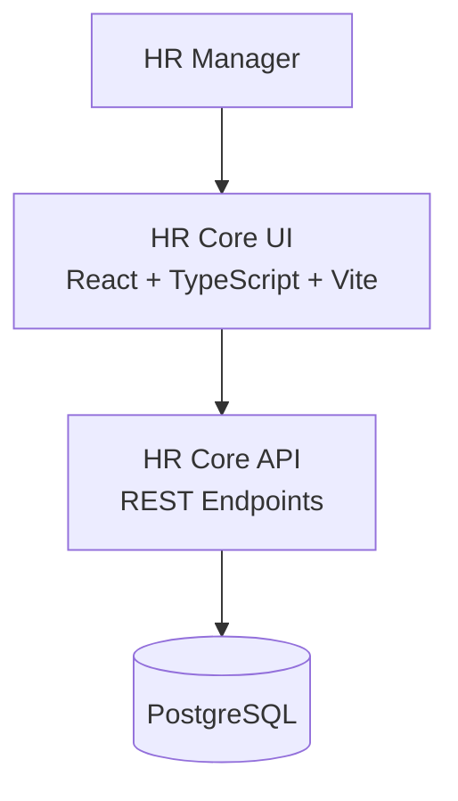

# HR Core UI - Employee Salary Management Tool

HR Core UI is a professional Employee Management and Salary Analytics dashboard for HR teams.

It is built with React, TypeScript, Vite, and Material UI, and integrates with the HR Core API for employee and analytics data.

## Overview

Organizations managing salary data in spreadsheets often face:

- Slow, manual employee updates
- Difficult salary reporting
- Limited compensation visibility
- Data consistency challenges at scale

This application provides a centralized web experience for HR managers to maintain employee records and answer compensation questions quickly.

## Product Goals

- Manage employee salary data in one place
- Support fast employee CRUD workflows
- Provide actionable salary insights by country, department, and job title
- Keep the experience responsive for ~10,000 employees
- Maintain clear architecture and testability for future growth

## Core Features

### Employee Management

- Create employee records
- View employee records
- Update employee records
- Delete employee records
- Soft-delete aware workflows (handled by API)

### Search and Discovery

- Search employees by name
- Filter by country, department, and job title
- Sort by supported table fields
- Server-side pagination for large datasets

### Salary Analytics

- Country-level salary insights (average, min, max)
- Job-title salary comparisons
- Workforce distribution metrics
- KPI and chart-based dashboard views

## Tech Stack

- React 19
- TypeScript
- Vite
- Material UI + MUI X Data Grid
- TanStack Query
- React Hook Form + Zod
- Axios
- Recharts
- React Router
- Vitest + Testing Library

## Architecture Summary

This repository is the frontend application. It follows feature-based organization and consumes an external API.



### Frontend Design Principles

- Feature-first folder organization
- Reusable shared components for consistency
- React Query for server-state management
- Schema-driven form validation using Zod
- Modular, testable components and hooks

## Project Structure

```txt
src/
├── api/
├── assets/
├── components/
│   └── common/
├── constants/
├── features/
│   ├── employees/
│   │   ├── api/
│   │   ├── components/
│   │   ├── constants/
│   │   ├── hooks/
│   │   ├── pages/
│   │   ├── schemas/
│   │   └── types/
│   └── analytics/
│       ├── api/
│       ├── components/
│       ├── constants/
│       ├── hooks/
│       ├── pages/
│       └── types/
├── hooks/
├── layouts/
├── routes/
├── styles/
├── test/
├── theme/
├── types/
├── utils/
├── App.tsx
└── main.tsx
```

## Getting Started

## 1. Prerequisites

- Node.js 20+
- npm 10+
- Running HR Core API service

## 2. Install Dependencies

```bash
npm install
```

## 3. Configure Environment

Create a .env file in the project root:

```bash
VITE_API_BASE_URL=http://localhost:4000
```

If not set, the app defaults to http://localhost:4000.

## 4. Run the App

```bash
npm run dev
```

The app will be available on Vite's default local URL.

## Scripts

- `npm run dev` - Start development server
- `npm run build` - Type-check and build production assets
- `npm run preview` - Preview production build
- `npm run test` - Run tests once
- `npm run test:watch` - Run tests in watch mode
- `npm run test:ci` - Run tests with coverage
- `npm run ci` - Run coverage tests and production build

## Performance and Scalability Notes

The product and API design target responsive behavior at scale.

- Server-side pagination keeps payloads small
- Search/filter/sort should execute at the database level
- Analytics are aggregation-driven and optimized for query workloads
- Indexing strategy is designed around known query patterns

The current target scale is ~10,000 employees with a roadmap-friendly path toward 100,000+.

## Testing and Quality

- Component and route tests via Vitest + Testing Library
- Validation driven by Zod schemas
- Query caching and request-state handling with TanStack Query
- Architecture focused on separation of concerns and maintainability

## Scope Notes

Current implementation focus:

- Employee management
- Employee search/filter/sort/pagination
- Salary analytics dashboard

Common enterprise capabilities intentionally out of initial scope:

- Authentication and authorization
- Payroll processing
- Approval workflows
- Notifications
- Audit history

## Documentation

Detailed project docs are available under the docs directory:

- Requirements
- Planning and design notes
- Architecture diagrams
- AI-assisted development process
- Solution design
- Trade-off explanations
- Performance considerations

## AI-Assisted Development

AI tools were used to accelerate ideation, architecture exploration, and documentation.
All technical decisions, implementation choices, and quality checks were validated through human review and testing.

## Repository

- GitHub: https://github.com/harshp21/hr-core-ui
