# Employee Salary Management Tool

## Architecture Diagrams

---

# Purpose

This document provides visual representations of the system architecture, application flow, database design, and deployment topology used by the Employee Salary Management Tool.

These diagrams illustrate how the system is organized and how different components interact with each other.

---

# 1. High-Level System Architecture

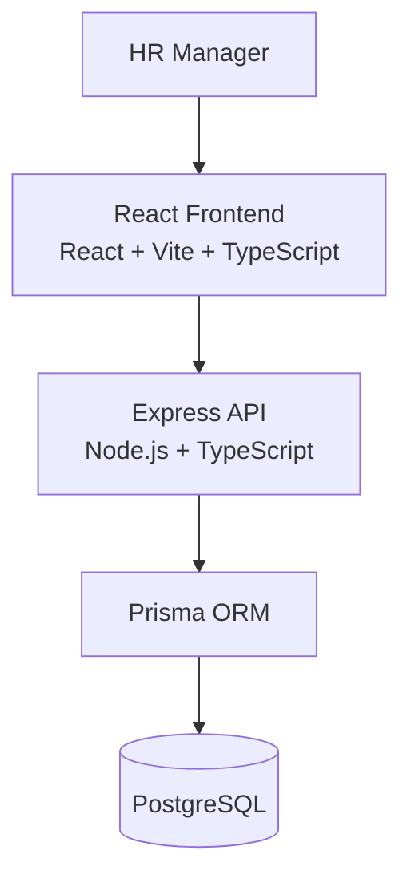

## Purpose

The architecture separates:

* Presentation Layer
* Business Logic Layer
* Data Access Layer

### Benefits

* Maintainability
* Scalability
* Independent deployments
* Clear separation of concerns

---

# 2. Backend Layered Architecture

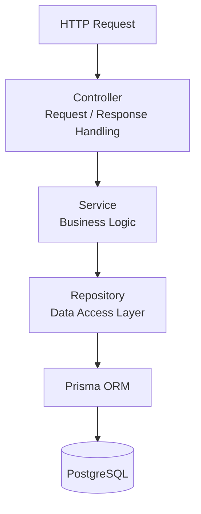

## Layer Responsibilities

### Controller

* Request parsing
* Response formatting
* HTTP concerns

### Service

* Business rules
* Application workflows
* Validation orchestration

### Repository

* Database access
* Query construction
* Aggregation queries

---

# 3. Backend Module Architecture

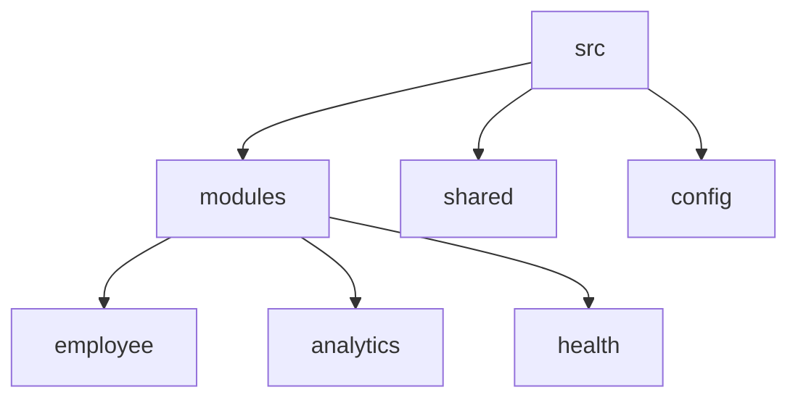

## Directory Structure

```txt
src/
│
├── modules/
│   ├── employee/
│   ├── analytics/
│   └── health/
│
├── shared/
├── config/
├── app.ts
└── server.ts
```

## Benefits

* Feature ownership
* Reduced coupling
* Easier onboarding
* Better scalability

---

# 4. Frontend Architecture

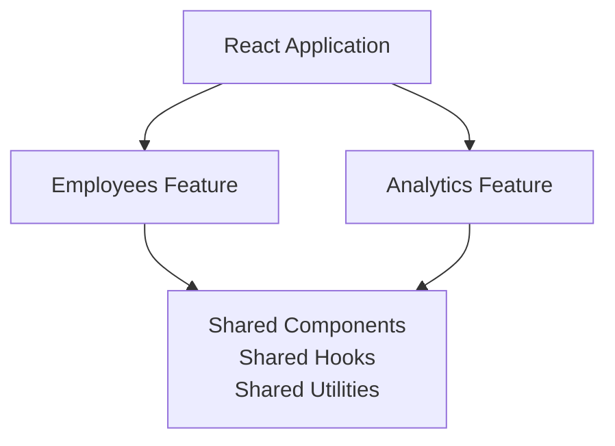

## Benefits

* Feature isolation
* Reusability
* Easier maintenance
* Scalability

---

# 5. Frontend Folder Structure

```txt
src/
│
├── app/
│   ├── providers/
│   ├── routes/
│   └── layouts/
│
├── features/
│   ├── employees/
│   └── analytics/
│
├── shared/
│   ├── api/
│   ├── components/
│   ├── hooks/
│   ├── types/
│   └── utils/
│
├── test/
│
├── App.tsx
└── main.tsx
```

---

# 6. Employee CRUD Request Flow

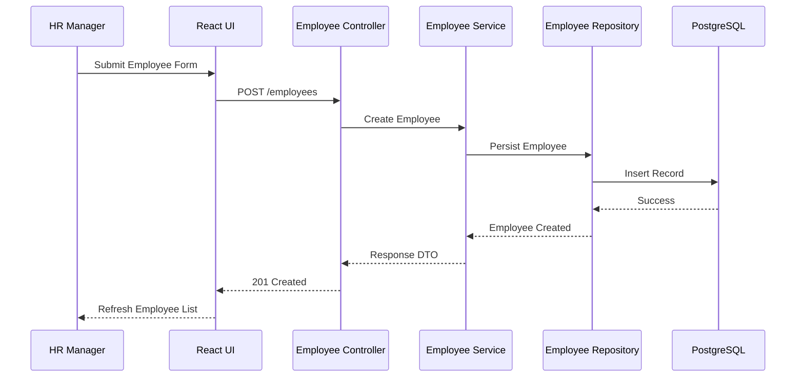

## Purpose

Illustrates the complete employee creation workflow.

---

# 7. Employee Search Flow

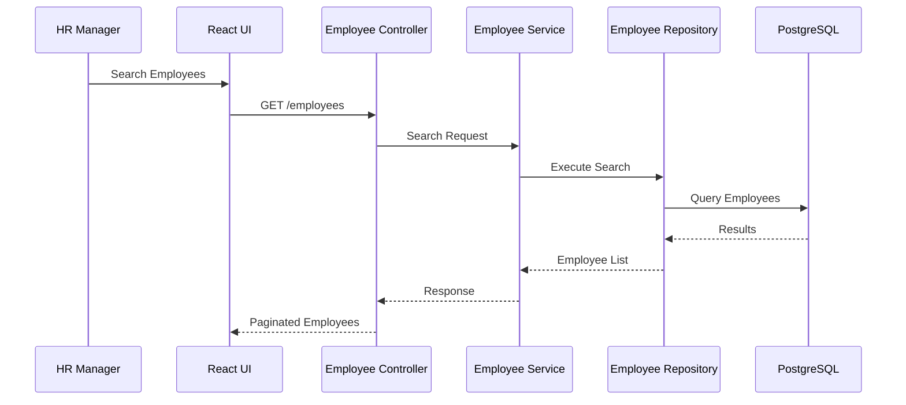

---

# 8. Analytics Request Flow

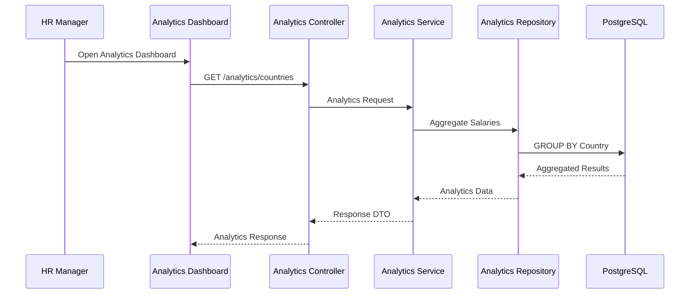

## Purpose

Illustrates how salary analytics are generated using database aggregations.

---

# 9. Validation Flow

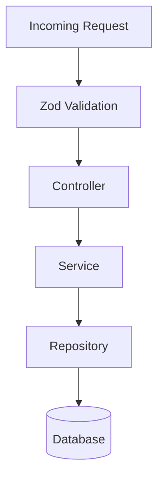

## Purpose

Separates:

### Transport Validation

Performed by:

* Zod schemas
* Request validation middleware

### Business Validation

Performed by:

* Service layer
* Domain rules

---

# 10. Error Handling Flow

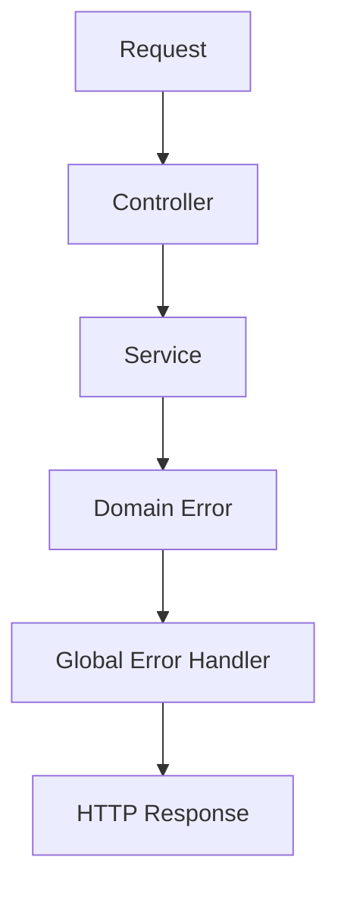

## Error Mapping

| Error Type      | HTTP Status |
| --------------- | ----------- |
| ValidationError | 400         |
| NotFoundError   | 404         |
| ConflictError   | 409         |
| InternalError   | 500         |

---

# 11. Database Entity Diagram

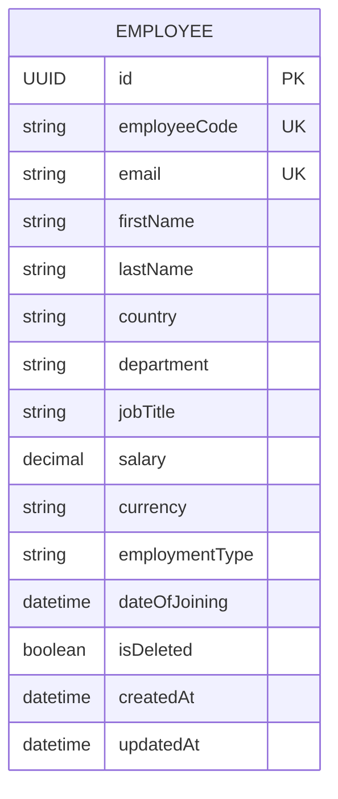

## Notes

Country, Department, and Job Title are intentionally denormalized for MVP simplicity.

---

# 12. Database Indexing Strategy

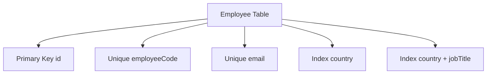

## Supported Queries

### Country Analytics

* AVG(salary)
* MIN(salary)
* MAX(salary)
* COUNT(*)

Grouped by country.

### Job Title Analytics

* AVG(salary)

Grouped by country and job title.

---

# 13. TDD Development Workflow

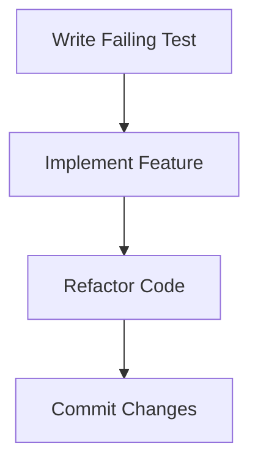

## Example Commit Flow

```txt
test(employee): add create employee tests

feat(employee): implement create employee service

refactor(employee): simplify employee validation
```

---

# 14. Deployment Architecture

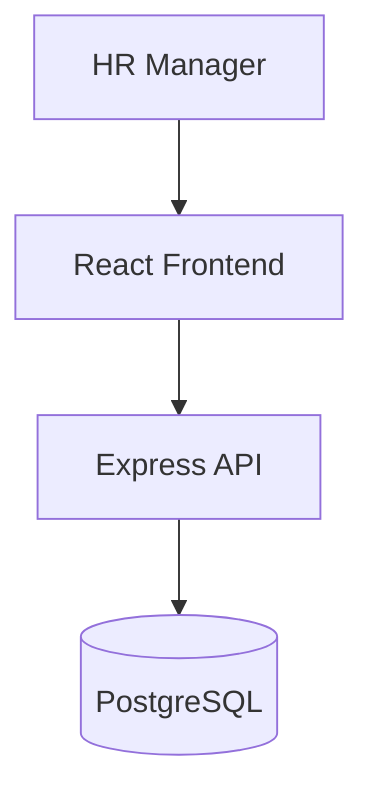

## Deployment Characteristics

Frontend and backend are deployed independently.

Benefits:

* Independent releases
* Easier scaling
* Clear separation of concerns
* Reduced deployment risk

---

# Architecture Summary

The architecture is designed around the following principles:

* Simplicity
* Maintainability
* Testability
* Scalability
* Clear separation of concerns

The modular monolith approach provides a strong foundation for the current requirements while supporting future growth and additional HR-related modules.
